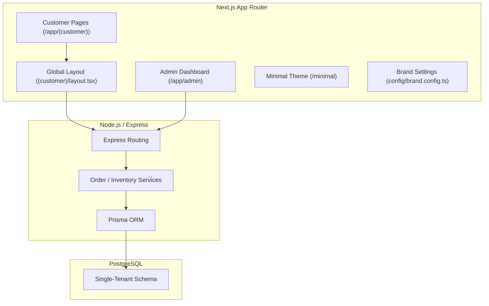

# Vistora E-Commerce: Multi-Storefront Architecture Eligibility Audit

This report presents a comprehensive structural, architectural, and codebase audit of the Vistora E-Commerce project to assess its readiness and eligibility for transforming into a reusable multi-storefront e-commerce platform.

---

## 1. Executive Summary

The Vistora E-Commerce project possesses a modern codebase structured with a **Next.js (App Router)** frontend and a **Node.js (TypeScript/Express)** backend using **Prisma ORM** with **PostgreSQL**. 

Currently, the codebase is designed as a **single-tenant, single-merchant application**. While there is an experimental `themes/minimal` folder, it is only capable of rendering a custom home page. All other core customer-facing views (Shop, Product Details, Cart, Checkout, Profile, and Orders) are hardcoded within the main route layout and rely on hardcoded branding, styling, and navigation links. 

At the database level, the system lacks any construct of a "Tenant", "Store", or "Storefront". As a result, the project is **PARTIALLY READY** for multi-storefront capabilities under a single parent company sharing a single catalog, but **NOT READY** for a SaaS-like multi-tenant storefront architecture where separate clients manage distinct inventories, catalogs, and orders under a unified codebase.

---

## 2. Current Architecture

### Folder Structure Overview
*   [`backend/`](file:///d:/NGS_Projects/vistora-ecom/backend): REST API and business logic layer.
*   [`frontend/`](file:///d:/NGS_Projects/vistora-ecom/frontend): Next.js storefront and Admin Portal dashboard.
    *   [`frontend/app/admin/`](file:///d:/NGS_Projects/vistora-ecom/frontend/app/admin): Admin portal views.
    *   [`frontend/app/(customer)/`](file:///d:/NGS_Projects/vistora-ecom/frontend/app/(customer)): Customer storefront pages.
    *   [`frontend/components/`](file:///d:/NGS_Projects/vistora-ecom/frontend/components): Reusable UI layouts and widgets.
    *   [`frontend/themes/`](file:///d:/NGS_Projects/vistora-ecom/frontend/themes): Location of storefront UI themes (currently containing only `minimal`).
    *   [`frontend/config/`](file:///d:/NGS_Projects/vistora-ecom/frontend/config): Global configuration settings.



---

## 3. Backend Reusability Audit

### Module-by-Module Eligibility Analysis

| Module | Status | Explanation & References |
| :--- | :--- | :--- |
| **Authentication & Users** | **PARTIALLY REUSABLE** | Leverages JWT tokens and role-based policies ([`rbac.middleware.ts`](file:///d:/NGS_Projects/vistora-ecom/backend/src/middleware/rbac.middleware.ts)). However, the `User` model lacks a `tenantId` or `storeId`. Consequently, customers and staff registered under Client A share the same authentication credentials and database scope as Client B. |
| **Products & Variants** | **PARTIALLY REUSABLE** | Relies on standard relational database structures ([`schema.prisma`](file:///d:/NGS_Projects/vistora-ecom/backend/prisma/schema.prisma)). The endpoints can serve catalog data to any storefront, but they cannot restrict products to specific clients since there is no `Store` mapping on the `Product` table. |
| **Inventory & Warehouses** | **PARTIALLY REUSABLE** | Quantities are adjusted globally on product variants ([`inventory.repository.ts`](file:///d:/NGS_Projects/vistora-ecom/backend/src/repositories/inventory.repository.ts)). It lacks multi-warehouse or tenant-specific inventory mapping, preventing different storefronts from keeping separate stock balances. |
| **Cart & Wishlist** | **REUSABLE** | Both modules are session-based or bound to the active `userId` ([`use-shopping.ts`](file:///d:/NGS_Projects/vistora-ecom/frontend/hooks/use-shopping.ts)). Since cart contents are processed per user, this works for multiple storefront views sharing one user pool. |
| **Orders & Checkout** | **PARTIALLY REUSABLE** | Deducts stock and logs transactions in a centralized table ([`order.service.ts`](file:///d:/NGS_Projects/vistora-ecom/backend/src/modules/order/order.service.ts)). However, because the backend relies on a single pool of orders without storefront identifiers, order routing and accounting cannot be isolated per storefront. |
| **Coupons & Banners** | **NOT REUSABLE** | Banners are currently hardcoded directly into frontend markup, and coupons are verified globally against subtotal value thresholds ([`order.service.ts`](file:///d:/NGS_Projects/vistora-ecom/backend/src/modules/order/order.service.ts)). There is no backend mapping to restrict a discount to a specific storefront. |

---

## 4. Admin Portal Reusability Audit

The Admin Portal (located under `frontend/app/admin`) manages products, orders, inventory, coupons, and reports. 

### Data Flow Verification
```
ADMIN PANEL (admin/products)  -->  POST /api/v1/products  -->  DATABASE (Prisma Schema)  -->  GET /api/v1/products  -->  CUSTOMER STOREFRONT
```
This flow is functional. However, because there is no storefront scoping at the database level:
1. **No Data Scoping:** Every storefront pointing to this backend must display the **same exact catalog**. An admin cannot assign a product, coupon, or banner to a specific storefront.
2. **Settings Lock:** Settings (like store currency, tax rate, shipping policies) are read from backend constants or global configurations. A change in the Admin Panel globally updates all customer storefronts simultaneously.

**Verdict:** **C. Requires architectural changes** (specifically, adding a tenant database scoping layer to support data isolation).

---

## 5. Customer Storefront Audit

An audit of the customer-facing directory (`frontend/app/(customer)`) reveals high coupling to the Vistora brand:

*   **Hardcoded Colors:** Main brand colors are hardcoded as tailwind values (e.g., `#A50025` Maroon, `#E66001` Orange) in [`customer-header.tsx`](file:///d:/NGS_Projects/vistora-ecom/frontend/components/layout/customer-header.tsx) and [`page.tsx`](file:///d:/NGS_Projects/vistora-ecom/frontend/app/(customer)/page.tsx).
*   **Hardcoded Assets:** The logo file path `/logo.png` is hardcoded in the brand config, and placeholders are hardcoded in promotional components.
*   **Hardcoded Banners & Copy:** Promotions like `"Enjoy Free Express Delivery on Orders Over ₹1500"` and coupon codes like `"CODE: VISTORA1500"` are hardcoded in [`customer-header.tsx`](file:///d:/NGS_Projects/vistora-ecom/frontend/components/layout/customer-header.tsx).
*   **Navigation & Links:** The main shop categories (`Women's Couture`, `Men's Apparel`) are hardcoded inside [`navigation.config.ts`](file:///d:/NGS_Projects/vistora-ecom/frontend/config/navigation.config.ts) instead of loading dynamically from the categories API.

---

## 6. Theme Architecture Audit

The `frontend/themes` folder contains an experimental `minimal` theme, but it is **not currently usable** for full multi-storefront deployments:

*   **Duplicate Layout wrapping:** The root `(customer)/layout.tsx` wraps all routes under `(customer)/` with `CustomerHeader` and `CustomerFooter`. When a user visits the `/minimal` page, Next.js renders the global Vistora header/footer *on top* of the minimal theme's header and footer, resulting in duplicate headers and footers.
*   **Catalog Page Hardcoding:** The `/shop`, `/product/[slug]`, `/cart`, and `/checkout` pages are hardcoded in `(customer)/` and always render standard components. Clicking "Shop" or clicking a product on the minimal homepage redirects the user back to the primary Vistora catalog theme.
*   **No CSS Isolation:** Theme design tokens are styled using custom class mappings ([`theme-tokens.ts`](file:///d:/NGS_Projects/vistora-ecom/frontend/themes/minimal/config/theme-tokens.ts)). These tokens are not bound to CSS variables or tailwind configs, resulting in styling leakage and rendering conflicts.

---

## 7. Configuration Audit

| Value | Location | Type | Multi-Storefront Readiness |
| :--- | :--- | :--- | :--- |
| **API Base URL** | `frontend/.env` | Environment | Fully isolated per deployment instance. |
| **Store Name** | `config/brand.config.ts` | Env/Hardcoded | Semi-isolated (controlled via `process.env.NEXT_PUBLIC_BRAND_NAME`). |
| **Logo Image** | `config/brand.config.ts` | Hardcoded | Hardcoded to `/logo.png`, preventing dynamic overrides. |
| **Currency Symbol** | `config/brand.config.ts` | Env/Hardcoded | Controlled via environment, but cannot vary per storefront dynamically. |
| **Footer Links** | `config/navigation.config.ts` | Hardcoded | Static values; requires configuration rewrite for new stores. |

---

## 8. API Data Flow Audit

The data flow for catalogue operations shows a clear pipeline:
1.  **Product Management:** Admin Panel triggers `POST /api/v1/products` $\rightarrow$ [`product.repository.ts`](file:///d:/NGS_Projects/vistora-ecom/backend/src/repositories/product.repository.ts) writes to PostgreSQL $\rightarrow$ Frontend retrieves via `useProducts()` React Query hook $\rightarrow$ Renders via `ProductCard`.
2.  **Lack of Storefront Scoping:** In this pipeline, the API does not query or filter data based on the source origin or storefront ID. The database contains a single flat registry of categories and items, meaning **every consumer gets the same catalog data**.

---

## 9. New Client Simulation

### Scenario: Client B wants a store with custom branding, logo, colors, and home layout.

#### A. SHOULD CHANGE (Theme Customization Only)
*   Homepage Layout configuration: should be defined inside Client B's theme folder.
*   Brand Tokens (Colors, fonts): should be resolved dynamically using CSS variables or Tailwind theme files.
*   Logo and Navigation Links: should be mapped dynamically from a tenant context.

#### B. SHOULD NOT CHANGE (Current Codebase Realities - Gaps)
*   [`layout.tsx`](file:///d:/NGS_Projects/vistora-ecom/frontend/app/(customer)/layout.tsx): **Must be modified** to remove the hardcoded Vistora header/footer wraps.
*   [`page.tsx`](file:///d:/NGS_Projects/vistora-ecom/frontend/app/(customer)/product/[slug]/page.tsx): **Must be modified** to support the new theme's product details layout.
*   [`brand.config.ts`](file:///d:/NGS_Projects/vistora-ecom/frontend/config/brand.config.ts): **Must be modified** to replace the hardcoded values (logoUrl, tagline).
*   [`schema.prisma`](file:///d:/NGS_Projects/vistora-ecom/backend/prisma/schema.prisma): **Must be modified** (or databases duplicated) because Client B's inventory and customers will mix with Client A's data.

---

## 10. Multi-Storefront Readiness Score

| Metric | Score | Key Rationale |
| :--- | :---: | :--- |
| **Backend Reusability** | **65 / 100** | Code is clean and modular, but lacks multi-tenant tables. |
| **Admin Reusability** | **50 / 100** | Portal manages standard records, but cannot target specific storefronts. |
| **API/Data Separation** | **75 / 100** | API contracts are clean, but lack tenant-scoping fields. |
| **Theme Separation** | **20 / 100** | Theme folder exists but is limited to a single home page. Layouts are hardcoded. |
| **Customer UI Separation**| **30 / 100** | Pages are built inside the core route group, rendering them monolithic. |
| **Configuration Architecture**| **40 / 100** | Configuration is static; relies heavily on build-time env variables. |
| **Branding Separation** | **30 / 100** | Main brand colors and logos are hardcoded in UI templates. |
| **Database Architecture** | **35 / 100** | Single-tenant database structure; requires separate database instances. |
| **Deployment Architecture** | **50 / 100** | Dockerfile is ready, but requires multi-instance setup to isolate clients. |
| **Overall Readiness Score**| **43 / 100** | **PARTIALLY ELIGIBLE** (Eligible for multi-instance; NOT eligible for multi-tenant). |

---

## 11. Architectural Gaps

1.  **CRITICAL: Hardcoded Storefront Layout Wrappers**
    *   *Reference:* [`(customer)/layout.tsx`](file:///d:/NGS_Projects/vistora-ecom/frontend/app/(customer)/layout.tsx)
    *   *Impact:* Prevents other themes from overriding the global header/footer, causing layout duplicates on custom pages.
2.  **CRITICAL: Single-Tenant Database Schema**
    *   *Reference:* [`schema.prisma`](file:///d:/NGS_Projects/vistora-ecom/backend/prisma/schema.prisma)
    *   *Impact:* Client A's orders, customers, and catalog are stored in the same tables as Client B's without partitions.
3.  **HIGH: Hardcoded Branding and Tailwind Colors**
    *   *Reference:* [`customer-header.tsx`](file:///d:/NGS_Projects/vistora-ecom/frontend/components/layout/customer-header.tsx)
    *   *Impact:* Prevents changing colors (e.g., Maroon to Emerald) without editing core component code.
4.  **HIGH: Monolithic Catalog Routing**
    *   *Reference:* `frontend/app/(customer)/shop/` and `/product/[slug]/`
    *   *Impact:* Themes cannot customize the shop grid or product details layout without modifying the core files.

---

## 12. Recommended Target Architecture

To enable clean storefront separation without duplicating core code, the codebase should evolve into a **Clean Onion Core Architecture**:

```
                    VISTORA E-COMMERCE CORE
                             │
          ┌──────────────────┼──────────────────┐
          │                  │                  │
       Backend             Admin            Platform
    (Shared API)      (Multitenant)    (Context Providers)
          │                  │                  │
          └──────────────────┼──────────────────┘
                             │
                       Shared API/Data
                             │
              ┌──────────────┼──────────────┐
              │              │              │
          Storefront A   Storefront B   Storefront C
          Theme A        Theme B        Theme C
```

### Folder Reorganization Plan:
1.  **Core API/Data Layer (`frontend/platform/`):** Houses all React hooks, API services, contexts, and helper utils. Completely decoupled from presentation classes.
2.  **Shared UI Library (`frontend/components/`):** Contains pure, generic UI components (buttons, input boxes, spinners) styled via CSS variables.
3.  **Tenant themes (`frontend/themes/`):**
    *   `themes/minimal/`
    *   `themes/couture/`
    Each theme implements its own home, product grid, details, and layout header/footer.
4.  **Dynamic Routing Resolver (`frontend/app/(customer)/`):** Page routes read the active theme from store configuration and dynamically render the correct theme layout:
    ```tsx
    const activeTheme = useStoreConfig().theme; // e.g. "minimal"
    const HomePage = dynamic(() => import(`@/themes/${activeTheme}/pages/home-page`));
    ```

---

## 13. Migration/Refactoring Requirements

To safely support multiple storefronts, execute the following refactoring roadmap:
1.  **Introduce CSS Variables for Styling:** Replace hardcoded colors (like `#A50025`) with Tailwind config tokens mapped to CSS variables (e.g., `var(--color-primary)`), defined inside global CSS stylesheet.
2.  **Decouple Layout Header/Footer:** Modify [`(customer)/layout.tsx`](file:///d:/NGS_Projects/vistora-ecom/frontend/app/(customer)/layout.tsx) to resolve and render the active theme's header/footer dynamically rather than importing static components.
3.  **Database Tenant Column Addition:** If deploying as a single multi-tenant DB, add `tenantId` fields to all core Prisma models (`Product`, `Order`, `Category`) and enforce filtering in backend query controllers.
4.  **Admin Portal Storefront Filter:** Add a storefront selector dropdown in the Admin Portal header, enabling managers to assign products or configurations to a specific storefront.

---

## 14. Final Verdict

### Verdict: **3. PARTIALLY READY — architectural refactoring required**

### Summary Answer:
**"Can we create another e-commerce website by changing ONLY the customer-facing frontend UI/theme while keeping the same Backend and Admin Portal, with Admin data automatically synchronized to the new storefront?"**

**Answer: YES WITH CHANGES**

#### Explanation:
1.  **What works now:** If you duplicate the database instance (multi-instance setup) and deploy a separate instance of the frontend with updated environment variables, you can create a new storefront pointing to its own admin data immediately.
2.  **What requires refactoring:** To do this under a **single deployed instance** of the backend and Admin Portal, you must refactor the database schema to support multi-tenancy (`tenantId` column), update the Next.js global layout file to resolve headers/footers dynamically, and replace hardcoded brand colors with CSS variables.

---
*Audit compiled by Antigravity AI Engine on 2026-08-19.*
